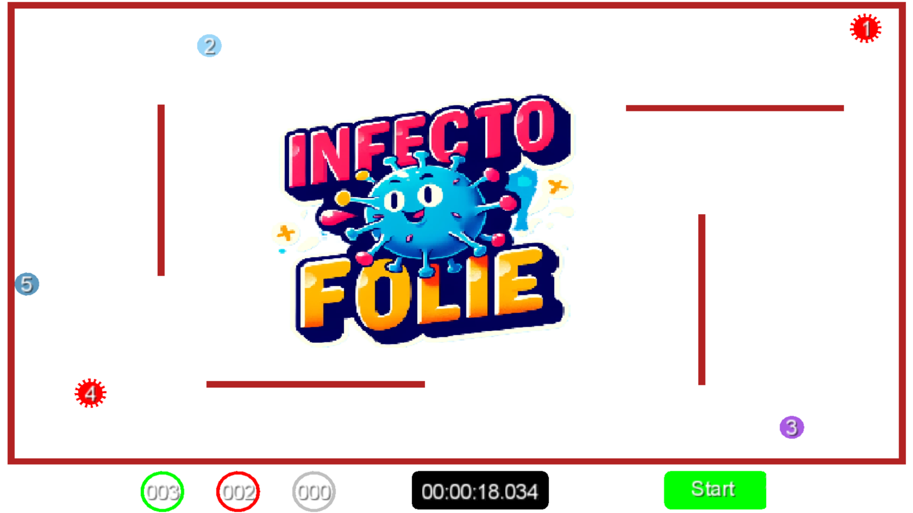

## Introduction

Notre jeu peut accueillir plusieurs joueurs, allant de 2 jusqu'à 100 participants. L'idée de jeu est la suivante : pour une partie de 20 joueurs, chaque participant joue pour soi. La partie débute avec 3 joueurs infectés choisis au hasard. Les infectés doivent transmettre leur maladie à des survivants, qui guérissent en répétant le même processus jusqu'à la fin de la manche, d'une durée de 20 secondes. À la fin de ce délai, les infectés meurent. On relance la partie avec 17 joueurs (20-3), toujours avec 3 infectés choisis au hasard, et le même processus se répète jusqu'à ce qu'il ne reste que 5 joueurs. À ce stade, un joueur est infecté au lieu de trois, dans le but d'aboutir à un seul gagnant à la fin de la partie.

## Paramètres de jeu

Les paramètres à personnaliser incluent la couleur des joueurs, le volume du son, le temps restant et la durée totale de la partie (soit la durée d'une manche).

 - Couleur des joueurs
 - Volume du son
 - Le temps d'une manche
 - Durée totale d'une partie

## Jouer

Après avoir récuperé le projet :

   - **Compiler** : mvn install

   - **Lancer le jeu** : java -jar target/my-spark-app-1.0-SNAPSHOT-jar-with-dependencies.jar